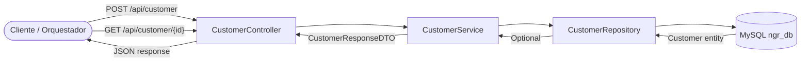

# Documentación Técnica: Customer Service

## 1. Descripción Operativa
El Customer Service es el módulo de gestión de clientes del holding NGRestaurant. Provee las operaciones de registro de nuevos comensales y consulta de perfiles individuales, garantizando la unicidad del correo electrónico como identificador lógico en el ecosistema. Implementa políticas de seguridad mediante hashing de contraseñas con BCrypt y control de estado activo/inactivo de cada cuenta.

## 2. Diagrama de Arquitectura de Flujo (Mermaid)



## 3. Inventario Estructurado de Componentes (Tabla)

| Capa | Archivo / Nombre de Clase | Propósito Técnico |
|---|---|---|
| Controller | `controller.CustomerController` | Expone endpoints REST para registro y consulta de clientes |
| DTO | `dto.customer.CustomerRegisterDTO` | Payload de entrada con validaciones `@NotBlank`, `@Email` |
| DTO | `dto.customer.CustomerResponseDTO` | Payload de salida con `fullName`, `isActive`, `message` |
| Model | `model.Customer` | Entidad JPA mapeada a la tabla `customers` |
| Repository | `repository.CustomerRepository` | Interface JPA con método `findByEmail(String)` |
| Service | `service.InterfaceCustomerService` | Contrato con métodos `register` y `findById` |
| Service | `service.CustomerService` | Implementación transaccional con hashing BCrypt |
| Exception | `exception.DuplicateEmailException` | Excepción lanzada cuando el email ya existe |
| Exception | `exception.GlobalExceptionHandler` | Handler centralizado que responde HTTP 409 para email duplicado |

## 4. Especificación del Contrato API REST (Endpoints)

### 4.1. Registrar Cliente

**`POST /api/customer`**

**Payload de Entrada (JSON):**
```json
{
  "firstName": "Carlos",
  "lastName": "Mendoza",
  "email": "carlos.mendoza@email.com",
  "password": "MiClaveSegura2026",
  "phone": "999888777",
  "address": "Av. Larco 123, Miraflores"
}
```

**Validaciones JSR-380 aplicadas:**
| Campo | Regla |
|---|---|
| `firstName` | `@NotBlank` |
| `lastName` | `@NotBlank` |
| `email` | `@NotBlank`, `@Email` |
| `password` | `@NotBlank` |

**Respuesta Exitosa — `201 CREATED`:**
```json
{
  "customerId": 1,
  "email": "carlos.mendoza@email.com",
  "fullName": "Carlos Mendoza",
  "isActive": true,
  "message": "Cliente registrado exitosamente"
}
```

**Respuesta por Error — `409 CONFLICT`:**
```json
{
  "error": "El email carlos.mendoza@email.com ya se encuentra registrado"
}
```

**Respuesta por Validación — `400 BAD REQUEST`:**
```json
{
  "email": "must be a well-formed email address",
  "password": "must not be blank"
}
```

### 4.2. Obtener Cliente por ID

**`GET /api/customer/{id}`**

**Respuesta Exitosa — `200 OK`:**
```json
{
  "customerId": 1,
  "email": "carlos.mendoza@email.com",
  "fullName": "Carlos Mendoza",
  "isActive": true,
  "message": "Cliente encontrado"
}
```

**Respuesta por Error — `404 NOT FOUND`:**
```json
{
  "error": "Cliente con id 99 no encontrado"
}
```

## 5. Políticas y Reglas de Negocio Implementadas

- **Unicidad de email:** Se verifica mediante `findByEmail()` antes de persistir. Si existe, se lanza `DuplicateEmailException` y se retorna HTTP 409.
- **Hashing de contraseñas:** La propiedad `password` se codifica con `BCryptPasswordEncoder` antes de almacenarse. Nunca se persiste texto plano.
- **Fecha de registro automática:** El campo `registrationDate` se asigna como `LocalDateTime.now()` y está marcado como `updatable = false` para evitar modificaciones posteriores.
- **Estado activo por defecto:** Todo cliente nuevo se registra con `isActive = true`.
- **Sanitización de respuesta:** El `password` nunca se incluye en el `CustomerResponseDTO`; solo se retornan datos no sensibles.
