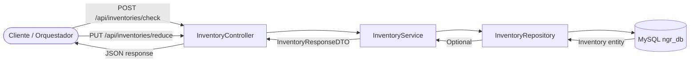

# Documentación Técnica: Inventory Service

## 1. Descripción Operativa
El Inventory Service administra el control de existencias del catálogo global de NGRestaurant. Expone operaciones para consultar disponibilidad de stock y realizar descuentos controlados tras la aprobación de pagos. Implementa un umbral crítico de reabastecimiento que genera alertas predictivas cuando el stock desciende por debajo de 5 unidades, habilitando la integración asíncrona con el Servicio de IA para predicción de compras.

## 2. Diagrama de Arquitectura de Flujo (Mermaid)



## 3. Inventario Estructurado de Componentes (Tabla)

| Capa | Archivo / Nombre de Clase | Propósito Técnico |
|---|---|---|
| Controller | `controller.InventoryController` | Expone endpoints para consulta y reducción de stock |
| DTO | `dto.inventory.StockCheckRequestDTO` | Payload de entrada con `@NotNull productId`, `@NotNull @Min(1) quantity` |
| DTO | `dto.inventory.StockUpdateRequestDTO` | Payload de entrada con `@NotNull productId`, `@NotNull @Min(1) quantityToDeduct` |
| DTO | `dto.inventory.InventoryResponseDTO` | Payload de salida con `currentStock`, `isAvailable`, `message` |
| Model | `model.Inventory` | Entidad JPA mapeada a la tabla `inventories` |
| Repository | `repository.InventoryRepository` | Interface JPA con método `findByProductId(Long)` |
| Service | `service.InterfaceInventoryService` | Contrato con métodos `checkStockAvailability` y `reduceStock` |
| Service | `service.InventoryService` | Implementación transaccional con umbral de reabastecimiento |
| Exception | `exception.InsufficientStockException` | Excepción lanzada cuando no hay stock suficiente para reducir |
| Exception | `exception.GlobalExceptionHandler` | Handler que responde HTTP 409 para stock insuficiente |

## 4. Especificación del Contrato API REST (Endpoints)

### 4.1. Consultar Disponibilidad de Stock

**`POST /api/inventories/check`**

**Payload de Entrada (JSON):**
```json
{
  "productId": 101,
  "quantity": 3
}
```

**Validaciones JSR-380 aplicadas:**
| Campo | Regla |
|---|---|
| `productId` | `@NotNull` |
| `quantity` | `@NotNull`, `@Min(1)` |

**Respuesta Exitosa — `200 OK` (Stock disponible):**
```json
{
  "productId": 101,
  "currentStock": 25,
  "isAvailable": true,
  "message": "Stock disponible"
}
```

**Respuesta Exitosa — `200 OK` (Stock insuficiente):**
```json
{
  "productId": 101,
  "currentStock": 2,
  "isAvailable": false,
  "message": "Stock insuficiente: disponible 2, solicitado 3"
}
```

**Respuesta Exitosa — `200 OK` (Producto no encontrado):**
```json
{
  "productId": 999,
  "currentStock": 0,
  "isAvailable": false,
  "message": "Producto no encontrado en inventario"
}
```

### 4.2. Reducir Stock

**`PUT /api/inventories/reduce`**

**Payload de Entrada (JSON):**
```json
{
  "productId": 101,
  "quantityToDeduct": 2
}
```

**Validaciones JSR-380 aplicadas:**
| Campo | Regla |
|---|---|
| `productId` | `@NotNull` |
| `quantityToDeduct` | `@NotNull`, `@Min(1)` |

**Respuesta Exitosa — `200 OK` (Stock actualizado sin alerta):**
```json
{
  "productId": 101,
  "currentStock": 23,
  "isAvailable": true,
  "message": "Stock actualizado exitosamente"
}
```

**Respuesta Exitosa — `200 OK` (Stock actualizado con alerta predictiva):**
```json
{
  "productId": 101,
  "currentStock": 3,
  "isAvailable": true,
  "message": "Stock actualizado exitosamente | Alerta Predictiva de Reabastecimiento: stock por debajo del umbral crítico (5 unidades)"
}
```

**Respuesta por Error — `409 CONFLICT` (Stock insuficiente):**
```json
{
  "error": "stock_insufficient",
  "message": "Stock insuficiente para el producto 101: disponible 2, solicitado 5"
}
```

**Respuesta por Error — `404 NOT FOUND` (Producto no existe):**
```json
{
  "error": "not_found",
  "message": "Producto con id 999 no encontrado en inventario"
}
```

## 5. Políticas y Reglas de Negocio Implementadas

- **Umbral crítico de reabastecimiento:** Cuando el stock resultante después de una reducción es menor a 5 unidades, el `message` del DTO de salida incluye la flag `"Alerta Predictiva de Reabastecimiento"` para ser capturada asíncronamente por el Servicio de IA.
- **Actualización de `lastUpdate`:** Cada operación de reducción registra `LocalDateTime.now()` en el campo `lastUpdate` para trazabilidad.
- **Validación de existencia previa:** `checkStockAvailability` retorna `isAvailable = false` con mensaje descriptivo si el `productId` no existe, sin lanzar excepción.
- **Consistencia transaccional:** Todo el flujo de reducción de stock está anotado con `@Transactional` para garantizar atomicidad.
