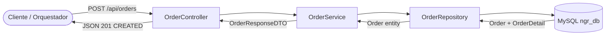

# Documentación Técnica: Order Service

## 1. Descripción Operativa
El Order Service gestiona la creación de pedidos en el ecosistema NGRestaurant. Recibe una orden con múltiples ítems, calcula automáticamente los subtotales por producto y el total acumulado de la compra, e inicializa la orden con estados `PENDING` tanto para pago como para despacho. Opera en cascada con `OrderDetail` para garantizar la integridad referencial de los ítems asociados a cada orden maestra.

## 2. Diagrama de Arquitectura de Flujo (Mermaid)



## 3. Inventario Estructurado de Componentes (Tabla)

| Capa | Archivo / Nombre de Clase | Propósito Técnico |
|---|---|---|
| Controller | `controller.OrderController` | Expone endpoint para creación de órdenes |
| DTO | `dto.order.OrderDetailDTO` | Payload por ítem con `@NotNull productId`, `@NotNull @Min(1) quantity`, `@NotNull @Positive appliedPrice` |
| DTO | `dto.order.OrderRequestDTO` | Payload de entrada con `@NotNull customerId` y `@NotEmpty List<OrderDetailDTO>` |
| DTO | `dto.order.OrderResponseDTO` | Payload de salida con `orderId`, `status`, `message` |
| Model | `model.Order` | Entidad JPA mapeada a la tabla `orders` con `@OneToMany` a OrderDetail |
| Model | `model.OrderDetail` | Entidad JPA mapeada a la tabla `order_details` con `@ManyToOne` a Order |
| Repository | `repository.OrderRepository` | Interface JPA con método `findByCustomerId(Long)` |
| Service | `service.InterfaceOrderService` | Contrato con método `createOrder` |
| Service | `service.OrderService` | Implementación transaccional con cálculo de subtotales |

## 4. Especificación del Contrato API REST (Endpoints)

### 4.1. Crear Orden

**`POST /api/orders`**

**Payload de Entrada (JSON):**
```json
{
  "customerId": 1,
  "items": [
    {
      "productId": 101,
      "quantity": 2,
      "appliedPrice": 25.50
    },
    {
      "productId": 102,
      "quantity": 1,
      "appliedPrice": 45.00
    }
  ]
}
```

**Validaciones JSR-380 aplicadas:**
| Campo | Regla |
|---|---|
| `customerId` | `@NotNull` |
| `items` | `@NotEmpty` |
| `items[].productId` | `@NotNull` |
| `items[].quantity` | `@NotNull`, `@Min(1)` |
| `items[].appliedPrice` | `@NotNull`, `@Positive` |

**Cálculo interno:**
| Item | Cantidad | Precio | SubTotal |
|---|---|---|---|
| 101 | 2 | 25.50 | 51.00 |
| 102 | 1 | 45.00 | 45.00 |
| **Total orden** | | | **96.00** |

**Respuesta Exitosa — `201 CREATED`:**
```json
{
  "orderId": 1,
  "status": "PENDING",
  "message": "Orden creada exitosamente"
}
```

**Respuesta por Error — `400 BAD REQUEST` (Validación):**
```json
{
  "customerId": "must not be null",
  "items": "must not be empty"
}
```

## 5. Políticas y Reglas de Negocio Implementadas

- **Cálculo automático de subtotales:** Por cada `OrderDetailDTO` se calcula `subTotal = quantity × appliedPrice`, acumulándose en `totalAmount` de la orden maestra.
- **Persistencia en cascada:** La relación `@OneToMany(cascade = CascadeType.ALL)` garantiza que al guardar la orden, todos sus `OrderDetail` hijos se persistan automáticamente.
- **Estados iniciales:** Toda orden nueva se crea con `paymentStatus = "PENDING"` y `orderStatus = "PENDING"`, quedando a la espera del flujo de pago y despacho.
- **Transaccionalidad:** El método `createOrder` está anotado con `@Transactional` para asegurar que la orden y sus detalles se persistan en una sola transacción atómica.
