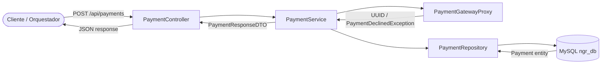

# Documentación Técnica: Payment Service

## 1. Descripción Operativa
El Payment Service gestiona el procesamiento de pagos dentro del holding NGRestaurant. Actúa como fachada entre el frontend y una pasarela financiera simulada (`PaymentGatewayProxy`), aplicando reglas de negocio y normativas PCI-DSS simuladas. Si la transacción es exitosa, persiste el registro con estado `APPROVED`; si el token de tarjeta finaliza en `9999`, simula un rechazo por fondos insuficientes y retorna un error controlado HTTP 402.

## 2. Diagrama de Arquitectura de Flujo (Mermaid)



## 3. Inventario Estructurado de Componentes (Tabla)

| Capa | Archivo / Nombre de Clase | Propósito Técnico |
|---|---|---|
| Controller | `controller.PaymentController` | Expone endpoint para procesar pagos |
| DTO | `dto.payment.PaymentRequestDTO` | Payload de entrada con `@NotNull orderId/customerId/amount`, `@NotBlank paymentMethod/tokenCard` |
| DTO | `dto.payment.PaymentResponseDTO` | Payload de salida con `transactionId`, `paymentStatus`, `errorCode`, `message` |
| Model | `model.Payment` | Entidad JPA mapeada a la tabla `payments` con `orderId` único |
| Repository | `repository.PaymentRepository` | Interface JPA con método `findByOrderId(Long)` |
| Proxy | `proxy.PaymentGatewayProxy` | Componente simulador de pasarela bancaria externa |
| Service | `service.InterfacePaymentService` | Contrato con método `processPayment` |
| Service | `service.PaymentService` | Implementación transaccional que orquesta proxy + persistencia |
| Exception | `exception.PaymentDeclinedException` | Excepción lanzada cuando la pasarela rechaza el pago |
| Exception | `exception.GlobalExceptionHandler` | Handler que responde HTTP 402 para pagos rechazados |

## 4. Especificación del Contrato API REST (Endpoints)

### 4.1. Procesar Pago

**`POST /api/payments`**

**Payload de Entrada (JSON):**
```json
{
  "orderId": 1,
  "customerId": 1,
  "amount": 96.00,
  "paymentMethod": "VISA",
  "tokenCard": "4111111111111111"
}
```

**Validaciones JSR-380 aplicadas:**
| Campo | Regla |
|---|---|
| `orderId` | `@NotNull` |
| `customerId` | `@NotNull` |
| `amount` | `@NotNull`, `@Positive` |
| `paymentMethod` | `@NotBlank` |
| `tokenCard` | `@NotBlank` |

**Respuesta Exitosa — `200 OK` (Pago aprobado):**
```json
{
  "transactionId": "a1b2c3d4-e5f6-7890-abcd-ef1234567890",
  "paymentStatus": "APPROVED",
  "errorCode": null,
  "message": "Pago procesado exitosamente"
}
```

**Respuesta por Error — `402 PAYMENT REQUIRED` (Tarjeta rechazada):**
```json
{
  "errorCode": "INSUFFICIENT_FUNDS",
  "message": "Tarjeta rechazada o saldo insuficiente"
}
```

**Respuesta por Error — `400 BAD REQUEST` (Validación):**
```json
{
  "amount": "must be positive",
  "tokenCard": "must not be blank"
}
```

## 5. Políticas y Reglas de Negocio Implementadas

- **Simulación de pasarela PCI-DSS:** El `PaymentGatewayProxy` evalúa el `tokenCard`: si termina en `"9999"`, simula un rechazo por fondos insuficientes lanzando `PaymentDeclinedException`; de lo contrario genera un `UUID.randomUUID()` como código de transacción exitoso.
- **Unicidad de pago por orden:** La columna `orderId` en la entidad `Payment` está marcada como `unique = true`, garantizando que una orden solo pueda tener un pago registrado.
- **Registro de transacción aprobada:** Solo se persiste el `Payment` cuando la pasarela responde exitosamente. En caso de rechazo, no se almacena ningún registro en base de datos.
- **Mapeo de errores:** El `GlobalExceptionHandler` captura `PaymentDeclinedException` y retorna HTTP `402 Payment Required` con un JSON estructurado que contiene `errorCode` y `message` para que el orquestador pueda abortar la transacción de forma controlada.
