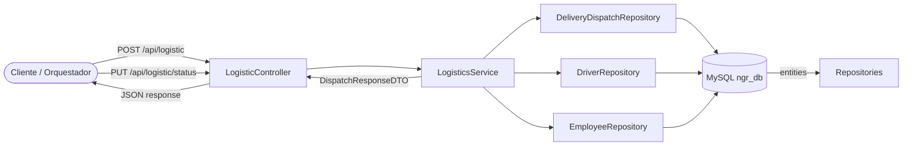

# Documentación Técnica: Logistics Service

## 1. Descripción Operativa
El Logistics Service coordina la logística de entregas a domicilio del holding NGRestaurant. Gestiona la creación de despachos, la asignación automática de repartidores disponibles, la simulación de rutas con estimación de llegada (+40 minutos) y la actualización de estados operativos. Incluye un mecanismo de liberación automática de repartidores cuando un despacho se marca como `DELIVERED`, optimizando la rotación de flota.

## 2. Diagrama de Arquitectura de Flujo (Mermaid)



## 3. Inventario Estructurado de Componentes (Tabla)

| Capa | Archivo / Nombre de Clase | Propósito Técnico |
|---|---|---|
| Controller | `controller.LogisticController` | Expone endpoints para crear y actualizar despachos |
| DTO | `dto.logistic.DispatchCreateRequestDTO` | Payload de entrada con `@NotNull orderId/latitude/longitude`, `@NotBlank deliveryAddress` |
| DTO | `dto.logistic.DispatchUpdateRequestDTO` | Payload de entrada con `@NotNull dispatchId`, `@NotBlank status`, `driverId` opcional |
| DTO | `dto.logistic.DispatchResponseDTO` | Payload de salida con `driverName`, `vehiclePlate`, `dispatchStatus`, `estimatedArrivalTime`, `message` |
| Model | `model.Employee` | Entidad JPA mapeada a la tabla `employees` (base de datos de empleados) |
| Model | `model.Driver` | Entidad JPA mapeada a la tabla `drivers` con PK `employeeId` manual |
| Model | `model.DeliveryDispatch` | Entidad JPA mapeada a la tabla `delivery_dispatches` |
| Repository | `repository.EmployeeRepository` | Interface JPA para consultar nombre del repartidor |
| Repository | `repository.DriverRepository` | Interface JPA con método `findByIsAvailableTrue()` |
| Repository | `repository.DeliveryDispatchRepository` | Interface JPA con método `findByOrderId(Long)` |
| Service | `service.InterfaceLogisticsService` | Contrato con métodos `createDispatch` y `updateStatus` |
| Service | `service.LogisticsService` | Implementación transaccional con asignación/liberación de drivers |
| Exception | `exception.GlobalExceptionHandler` | Handler que responde HTTP 404 para despachos no encontrados |

## 4. Especificación del Contrato API REST (Endpoints)

### 4.1. Crear Despacho

**`POST /api/logistic`**

**Payload de Entrada (JSON):**
```json
{
  "orderId": 1,
  "deliveryAddress": "Av. Larco 123, Miraflores",
  "latitude": -12.1234,
  "longitude": -77.5678
}
```

**Validaciones JSR-380 aplicadas:**
| Campo | Regla |
|---|---|
| `orderId` | `@NotNull` |
| `deliveryAddress` | `@NotBlank` |
| `latitude` | `@NotNull` |
| `longitude` | `@NotNull` |

**Respuesta Exitosa — `201 CREATED` (Con repartidor asignado):**
```json
{
  "dispatchId": 1,
  "orderId": 1,
  "driverName": "Juan Pérez",
  "vehiclePlate": "ABC-123",
  "dispatchStatus": "ASSIGNED",
  "estimatedArrivalTime": "2026-07-02T14:30:00",
  "message": "Despacho creado y repartidor asignado"
}
```

**Respuesta Exitosa — `201 CREATED` (Sin repartidor disponible):**
```json
{
  "dispatchId": 1,
  "orderId": 1,
  "driverName": null,
  "vehiclePlate": null,
  "dispatchStatus": "PENDING",
  "estimatedArrivalTime": "2026-07-02T14:30:00",
  "message": "Despacho creado en espera de repartidor disponible"
}
```

### 4.2. Actualizar Estado de Despacho

**`PUT /api/logistic/status`**

**Payload de Entrada (JSON):**
```json
{
  "dispatchId": 1,
  "status": "DELIVERED",
  "driverId": null
}
```

**Validaciones JSR-380 aplicadas:**
| Campo | Regla |
|---|---|
| `dispatchId` | `@NotNull` |
| `status` | `@NotBlank` |

**Respuesta Exitosa — `200 OK`:**
```json
{
  "dispatchId": 1,
  "orderId": 1,
  "driverName": "Juan Pérez",
  "vehiclePlate": "ABC-123",
  "dispatchStatus": "DELIVERED",
  "estimatedArrivalTime": "2026-07-02T13:50:00",
  "message": "Estado de despacho actualizado a DELIVERED"
}
```

**Respuesta por Error — `404 NOT FOUND`:**
```json
{
  "error": "not_found",
  "message": "Despacho con id 99 no encontrado"
}
```

## 5. Políticas y Reglas de Negocio Implementadas

- **Simulación de ruta MapBox:** El `estimatedArrivalTime` se calcula como `LocalDateTime.now().plusMinutes(40)` simulando el tiempo estimado de entrega.
- **Asignación automática de repartidores:** Al crear un despacho, se consulta `driverRepository.findByIsAvailableTrue()`. Si existe al menos un repartidor disponible, se asigna automáticamente y el estado cambia a `ASSIGNED`.
- **Bloqueo de repartidor:** Al asignar un driver, su campo `isAvailable` se establece en `false` para evitar doble asignación mientras esté en ruta.
- **Liberación automática:** Cuando el estado del despacho se actualiza a `DELIVERED`, el sistema recupera al `Driver` asignado y reestablece su `isAvailable = true`, liberándolo para nuevos despachos.
- **Consistencia transaccional:** Tanto la asignación como la liberación del driver ocurren dentro de la misma transacción `@Transactional` que la actualización del despacho.
